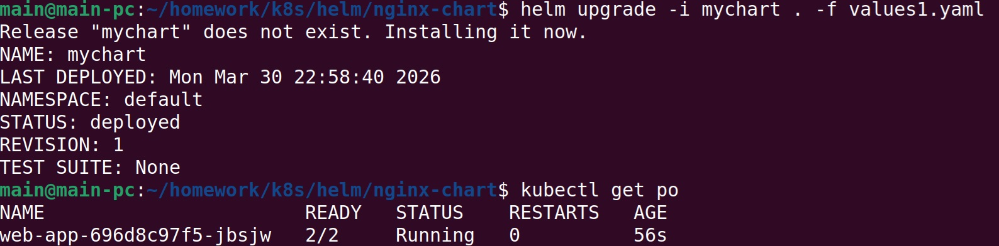
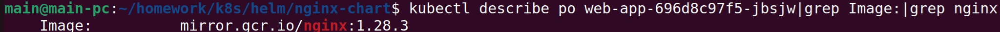
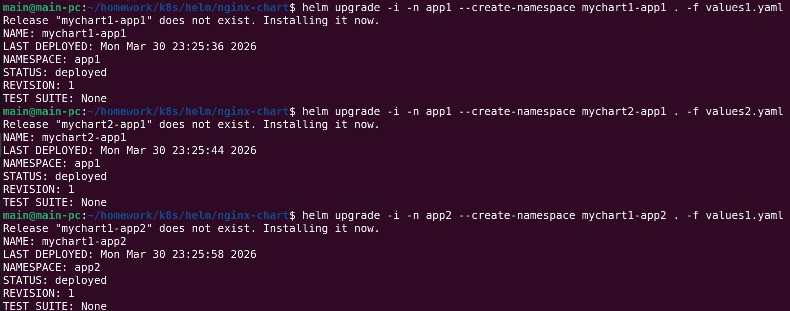
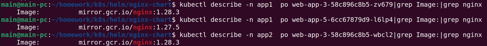

## Решение задания 1

Упаковка приложения в чарт:   
https://github.com/cranberry511/kuber-homeworks_2.4/blob/main/nginx-chart/Chart.yaml   

## Решение задания 2

Запуск несколько копий приложения, одна версия в namespace=app1, вторая версия в том же неймспейсе, третья версия в namespace=app2:

